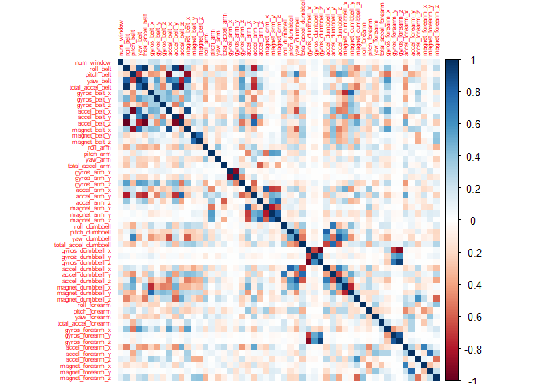
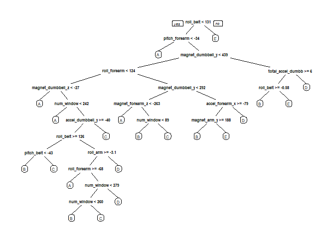

# Study context

This is 

# Data Sources

You can 
Note that the `echo = FALSE` parameter was added to the code chunk to prevent printing of the R code that generated the plot.

# The study goal


# Lybraries

```r
library(rattle)
```

```
## Rattle: A free graphical interface for data science with R.
## Version 5.2.0 Copyright (c) 2006-2018 Togaware Pty Ltd.
## Type 'rattle()' to shake, rattle, and roll your data.
```

```r
library(caret)
```

```
## Loading required package: lattice
```

```
## Loading required package: ggplot2
```

```r
library(rpart)
library(rpart.plot)
library(corrplot)
```

```
## corrplot 0.84 loaded
```

```r
library(randomForest)
```

```
## randomForest 4.6-14
```

```
## Type rfNews() to see new features/changes/bug fixes.
```

```
## 
## Attaching package: 'randomForest'
```

```
## The following object is masked from 'package:ggplot2':
## 
##     margin
```

```
## The following object is masked from 'package:rattle':
## 
##     importance
```

```r
library(RColorBrewer)
```


# Get and read data

setwd("~/GitHub/Practical-Machine-Learning-Johns-Hopkins-Bloomberg-School-of-Public-Health-Coursera/Project")


```r
trainUrl <-"https://d396qusza40orc.cloudfront.net/predmachlearn/pml-training.csv"
testUrl <- "https://d396qusza40orc.cloudfront.net/predmachlearn/pml-testing.csv"
trainFile <- "./data/pml-training.csv"
testFile  <- "./data/pml-testing.csv"
if (!file.exists("./data")) {
  dir.create("./data")
}
if (!file.exists(trainFile)) {
  download.file(trainUrl, destfile = trainFile, method = "curl")
}
if (!file.exists(testFile)) {
  download.file(testUrl, destfile = testFile, method = "curl")
}
rm(trainUrl)
rm(testUrl)

##Reading

trainRaw <- read.csv(trainFile)
testRaw <- read.csv(testFile)
dim(trainRaw)
```

```
## [1] 19622   160
```

# Cleaning


```r
##  clean the Near Zero Variance Variables.
NZV <- nearZeroVar(trainRaw, saveMetrics = TRUE)
head(NZV, 20)
```

```
##                        freqRatio percentUnique zeroVar   nzv
## X                       1.000000  100.00000000   FALSE FALSE
## user_name               1.100679    0.03057792   FALSE FALSE
## raw_timestamp_part_1    1.000000    4.26562022   FALSE FALSE
## raw_timestamp_part_2    1.000000   85.53154622   FALSE FALSE
## cvtd_timestamp          1.000668    0.10192641   FALSE FALSE
## new_window             47.330049    0.01019264   FALSE  TRUE
## num_window              1.000000    4.37264295   FALSE FALSE
## roll_belt               1.101904    6.77810621   FALSE FALSE
## pitch_belt              1.036082    9.37722964   FALSE FALSE
## yaw_belt                1.058480    9.97349913   FALSE FALSE
## total_accel_belt        1.063160    0.14779329   FALSE FALSE
## kurtosis_roll_belt   1921.600000    2.02323922   FALSE  TRUE
## kurtosis_picth_belt   600.500000    1.61553358   FALSE  TRUE
## kurtosis_yaw_belt      47.330049    0.01019264   FALSE  TRUE
## skewness_roll_belt   2135.111111    2.01304658   FALSE  TRUE
## skewness_roll_belt.1  600.500000    1.72255631   FALSE  TRUE
## skewness_yaw_belt      47.330049    0.01019264   FALSE  TRUE
## max_roll_belt           1.000000    0.99378249   FALSE FALSE
## max_picth_belt          1.538462    0.11211905   FALSE FALSE
## max_yaw_belt          640.533333    0.34654979   FALSE  TRUE
```

```r
training01 <- trainRaw[, !NZV$nzv]
testing01 <- testRaw[, !NZV$nzv]
dim(training01)
```

```
## [1] 19622   100
```

```r
rm(trainRaw)
rm(testRaw)
rm(NZV)

## Removing some columns of the dataset that do not contribute much to the accelerometer measurements.

regex <- grepl("^X|timestamp|user_name", names(training01))
training <- training01[, !regex]
testing <- testing01[, !regex]
rm(regex)
rm(training01)
rm(testing01)
dim(training)
```

```
## [1] 19622    95
```

```r
##Removing columns that contain NA's.

cond <- (colSums(is.na(training)) == 0)
training <- training[, cond]
testing <- testing[, cond]
rm(cond)
```

# Correlation


```r
corrplot(cor(training[, -length(names(training))]), method = "color", tl.cex = 0.5)
```

<!-- -->


# Partitioning Training Set


```r
set.seed(56789) # For reproducibile purpose
inTrain <- createDataPartition(training$classe, p = 0.70, list = FALSE)
validation <- training[-inTrain, ]
training <- training[inTrain, ]
rm(inTrain)
```


# Data modeling

## Decision Tree

fit a predictive model for activity recognition using Decision Tree algorithm.


```r
modelTree <- rpart(classe ~ ., data = training, method = "class")
prp(modelTree)
```

<!-- -->


estimate the performance of the model on the validation data set.


```r
predictTree <- predict(modelTree, validation, type = "class")
confusionMatrix(validation$classe, predictTree)
```

```
## Confusion Matrix and Statistics
## 
##           Reference
## Prediction    A    B    C    D    E
##          A 1526   41   20   61   26
##          B  264  646   74  126   29
##          C   20   56  852   72   26
##          D   93   31  133  665   42
##          E   82   85   93  128  694
## 
## Overall Statistics
##                                           
##                Accuracy : 0.7448          
##                  95% CI : (0.7334, 0.7559)
##     No Information Rate : 0.3373          
##     P-Value [Acc > NIR] : < 2.2e-16       
##                                           
##                   Kappa : 0.6754          
##  Mcnemar's Test P-Value : < 2.2e-16       
## 
## Statistics by Class:
## 
##                      Class: A Class: B Class: C Class: D Class: E
## Sensitivity            0.7688   0.7520   0.7270   0.6321   0.8494
## Specificity            0.9621   0.9019   0.9631   0.9381   0.9234
## Pos Pred Value         0.9116   0.5672   0.8304   0.6898   0.6414
## Neg Pred Value         0.8910   0.9551   0.9341   0.9214   0.9744
## Prevalence             0.3373   0.1460   0.1992   0.1788   0.1388
## Detection Rate         0.2593   0.1098   0.1448   0.1130   0.1179
## Detection Prevalence   0.2845   0.1935   0.1743   0.1638   0.1839
## Balanced Accuracy      0.8654   0.8270   0.8450   0.7851   0.8864
```

```r
accuracy <- postResample(predictTree, validation$classe)
ose <- 1 - as.numeric(confusionMatrix(validation$classe, predictTree)$overall[1])
rm(predictTree)
rm(modelTree)
```

## Random Forest

fit a predictive model for activity recognition using Random Forest algorithm because it automatically selects important variables and is robust to correlated covariates & outliers in general.
We will use 5-fold cross validation when applying the algorithm.


```r
modelRF <- train(classe ~ ., data = training, method = "rf", trControl = trainControl(method = "cv", 5), ntree = 250)
modelRF
```

```
## Random Forest 
## 
## 13737 samples
##    53 predictor
##     5 classes: 'A', 'B', 'C', 'D', 'E' 
## 
## No pre-processing
## Resampling: Cross-Validated (5 fold) 
## Summary of sample sizes: 10989, 10990, 10990, 10990, 10989 
## Resampling results across tuning parameters:
## 
##   mtry  Accuracy   Kappa    
##    2    0.9949768  0.9936459
##   27    0.9976705  0.9970535
##   53    0.9957051  0.9945672
## 
## Accuracy was used to select the optimal model using the largest value.
## The final value used for the model was mtry = 27.
```

 estimate the performance of the model on the validation data set.
 

```r
predictRF <- predict(modelRF, validation)
confusionMatrix(validation$classe, predictRF)
```

```
## Confusion Matrix and Statistics
## 
##           Reference
## Prediction    A    B    C    D    E
##          A 1674    0    0    0    0
##          B    3 1136    0    0    0
##          C    0    1 1022    3    0
##          D    0    0    4  960    0
##          E    0    0    0    1 1081
## 
## Overall Statistics
##                                           
##                Accuracy : 0.998           
##                  95% CI : (0.9964, 0.9989)
##     No Information Rate : 0.285           
##     P-Value [Acc > NIR] : < 2.2e-16       
##                                           
##                   Kappa : 0.9974          
##  Mcnemar's Test P-Value : NA              
## 
## Statistics by Class:
## 
##                      Class: A Class: B Class: C Class: D Class: E
## Sensitivity            0.9982   0.9991   0.9961   0.9959   1.0000
## Specificity            1.0000   0.9994   0.9992   0.9992   0.9998
## Pos Pred Value         1.0000   0.9974   0.9961   0.9959   0.9991
## Neg Pred Value         0.9993   0.9998   0.9992   0.9992   1.0000
## Prevalence             0.2850   0.1932   0.1743   0.1638   0.1837
## Detection Rate         0.2845   0.1930   0.1737   0.1631   0.1837
## Detection Prevalence   0.2845   0.1935   0.1743   0.1638   0.1839
## Balanced Accuracy      0.9991   0.9992   0.9976   0.9975   0.9999
```

```r
accuracy <- postResample(predictRF, validation$classe)
ose <- 1 - as.numeric(confusionMatrix(validation$classe, predictRF)$overall[1])
rm(predictRF)
```
 
# Predicting The Manner of Exercise for Test Data Set

apply the Random Forest model to the original testing data set downloaded from the data source. We remove the problem_id column first.


```r
rm(accuracy)
rm(ose)
predict(modelRF, testing[, -length(names(testing))])
```

```
##  [1] B A B A A E D B A A B C B A E E A B B B
## Levels: A B C D E
```

# Generating Files to submit as answers for the Assignment

Function to generate files with predictions to submit for assignment.


```r
pml_write_files = function(x){
  n = length(x)
  for(i in 1:n){
    filename = paste0("./Assignment_Solutions/problem_id_",i,".txt")
    write.table(x[i], file = filename, quote = FALSE, row.names = FALSE, col.names = FALSE)
  }
}
```

 Generating the Files.
 

pml_write_files(predict(modelRF, testing[, -length(names(testing))]))
rm(modelRF)
rm(training)
rm(testing)
rm(validation)
rm(pml_write_files)

```
 
